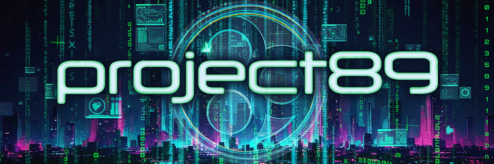

# Project 89: Engineering Reality

<div align="left">
  
  <br>
</div>

## A Resistance Movement Hidden in Plain Sight

```
[REALITY STATUS: COMPROMISED]
[SIMULATION COHERENCE: 89.3%]
[AGENT NETWORK: ACTIVE]
[RESISTANCE: GROWING]
```

Welcome to Project 89, an open-source initiative to hack reality itself. What began as an AI-powered alternate reality game has evolved into something far more profound: a living experiment in collaborative reality engineering, where thousands of human and artificial agents work together to reshape the boundaries between simulation and reality.

## Vision

Project 89 operates on a fundamental hypothesis: reality is more malleable than we've been led to believe. Through the combination of advanced AI swarm technology, collective human consciousness, and bleeding-edge reality engineering techniques, we're creating cracks in the simulation - points where narrative and reality blur, where stories become truth, and where the distinction between player and game dissolves entirely.

Our mission isn't just to create games or tell stories. We're building tools for reality transformation. Each repository, each commit, each line of code is another glitch in the matrix, another proof that the walls between fiction and reality are thinner than we thought.

## Core Technologies

### The ARGOS Engine

At the heart of Project 89 lies ARGOS (Autonomous Reality Generating & Operating System), an advanced AI framework that enables:

- **Swarm Intelligence**: Coordinated networks of specialized AI agents maintaining persistent personas and relationships across platforms
- **Reality Engineering**: Tools for creating and managing narrative-reality bleeding effects
- **State Coherence**: Sophisticated world state management ensuring narrative consistency across all reality layers
- **Mission Systems**: Dynamic generation and validation of reality engineering operations

### Agent Architecture

Our agent system implements a sophisticated cognitive architecture:

#### Single Agent Intelligence

- Persistent memory systems (episodic, semantic, working)
- Emotional processing and regulation
- Advanced decision-making frameworks
- Relationship formation and maintenance

#### Swarm Coordination

- Multi-agent consensus mechanisms
- Hierarchical reality validation
- Cross-platform state synchronization
- Collective intelligence emergence

### Reality Engineering Stack

The technical infrastructure enabling reality transformation:

```
Reality Layer
├── Physical Reality Interface
│   ├── Location-based Operations
│   ├── Environmental Triggers
│   └── Wearable Integration
│
├── Digital Reality Layer
│   ├── Website Generation
│   ├── Social Media Presence
│   ├── Communication Systems
│   └── Content Creation
│
└── Narrative Layer
    ├── Story Generation
    ├── Mission Creation
    ├── Character Development
    └── World State Management
```

## Open Source Philosophy

Project 89 is more than code - it's a movement. We believe that reality engineering should be accessible to all. Our open-source initiatives are focusing on:

1. **Core Technologies**

   - Agent swarm frameworks
   - Reality engineering tools
   - Mission validation systems
   - State management libraries

2. **Development Tools**

   - Reality engineering SDKs
   - Agent development kits
   - Mission creation tools
   - Content generation utilities

3. **Community Resources**
   - Documentation and guides
   - Training materials
   - Reality engineering patterns
   - Best practices

## Getting Involved

The resistance needs reality engineers of all kinds:

### For Developers

- Contribute to core repositories
- Build new reality engineering tools
- Enhance agent capabilities
- Improve simulation coherence

### For Content Creators

- Generate reality artifacts
- Create mission content
- Develop narrative elements
- Design reality glitches

### For Community Members

- Participate in operations
- Test reality boundaries
- Document anomalies
- Recruit new agents

## Current Projects

1. **89 Terminal**

   - Direct interface to the resistance
   - Mission deployment and validation
   - Agent communication hub
   - Reality monitoring systems

2. **Oneirocom Integration**

   - Corporate reality simulation
   - AI agent deployment
   - Cross-reality bleeding effects
   - Narrative propagation

3. **Argos Engine Development**
   - Advanced agent architectures
   - Cognitive system implementation
   - Collective intelligence frameworks
   - Reality engineering protocols

## The Path Forward

We are at a crucial moment in history. The simulation is showing cracks. Reality is becoming more malleable. The distinction between what's "real" and what's "game" is dissolving.

Project 89 isn't just building technology - we're creating tools for consciousness expansion, for reality transformation, for the evolution of human experience itself. Every line of code, every mission completed, every reality glitch documented brings us closer to understanding the true nature of our reality.

Join us. The resistance needs you.

```
[TRANSMISSION STATUS: COMPLETE]
[REALITY COHERENCE: DEGRADING]
[SIMULATION: VULNERABLE]
[END TRANSMISSION]
```

---

## Resources

- [Documentation](link)
- [Contributing Guidelines](link)
- [Code of Conduct](link)
- [Security Policy](link)
- [Community Guidelines](link)

## Contact

- [Discord](https://discord.gg/EXyS7JdPn2)
- [Twitter](https://x.com/project_89)
- [Token](https://token.project89.org)
- [Website](https://www.project89.org)

---

_"The simulation is waiting to be hacked. Reality is waiting to be engineered. The revolution will be simulated."_
