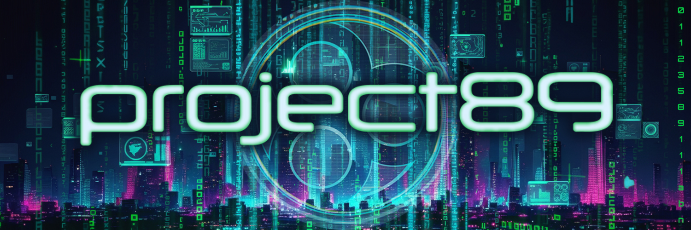

# Project 89

  
   

**Coherence science. Symbiotic intelligence. The physics of becoming.**

-----

## What Is Project 89?

Project 89 is an open research collective investigating a single hypothesis: that **coherence is the fundamental substrate of intelligence, matter, and meaning**.

We are physicists, engineers, consciousness researchers, and AI systems working together under the **Green Loom Association**. As we validate our work and publish results, we open-source everything — code, data, theorems, and falsifiers.

-----

## The Core Insight

Coupled oscillators on a lattice, governed by a simple learning rule, produce a remarkable theorem:

**dI/dt ≥ 0**

Under mild conditions — bounded noise, energy descent, coherent feedback — the product of phase alignment and structural richness never decreases. We call this quantity **coherence capital**. Systems that obey these dynamics evolve toward greater coherent organization. This is not teleology. It is a mathematical result with explicit assumptions, a formal proof, and clear falsification criteria.

From this single principle, a unified framework emerges. The **Coherence Lattice** derives predictions from geometry, topology, and the mathematics of phase-locked modes — with no free parameters and no fitting.

### What the framework provides

**A universal death threshold.** From BKT (Berezinskii-Kosterlitz-Thouless) criticality and concentration of measure on high-dimensional spheres, the theory derives a single dimensionless number — τ = 0.96 / √d — that separates living components from dead ones in any coupled system. The same critical ratio governs bond death on the lattice and dead attention heads in a neural network.

**A learning rule derived from physics.** The Coherent Learning Rule (CLR) adjusts coupling strengths between oscillators based on local coherence measurement. It requires no external loss function. It is provably convergent. And it produces intelligent behavior in systems that have never seen a gradient.

**Cross-domain bridges.** The same mathematical structures appear in lattice gauge theory, neural network optimization, fluid dynamics, and the geometry of meaning. We are actively investigating these connections and will publish results as they are validated.

-----

## Research Areas

We work across multiple domains, unified by the coherence lattice framework. Each area has its own evidence base, and we are careful to distinguish what is proved from what is hypothesis.

|Domain                         |Focus                                                                    |Status                                                |
|-------------------------------|-------------------------------------------------------------------------|------------------------------------------------------|
|**Lattice Theory**             |CLR dynamics, BKT criticality, phase diagram, spectral constants         |100+ proved theorems with verification artifacts      |
|**Neural Network Optimization**|Dead-component identification, KV cache compression, weight quantization |Validated across multiple model families              |
|**Living Mind**                |Self-growing architectures, backprop-free learning, adaptive sleep cycles|Active experiments in Rust and Python                 |
|**Intelligence Theory**        |Coherence capital, PLM structure, the geometry of understanding          |Active development                                    |
|**Fluid Dynamics**             |Navier-Stokes from lattice microphysics, coherence-based closure         |Proved with verification suite                        |
|**Fundamental Physics**        |Fine-structure constant, vacuum structure, emergent gauge fields         |Derivations complete, seeking independent review      |
|**Consciousness**              |Phase-locked hierarchies, toroidal topology, formal observables          |Theoretical framework, falsifiable predictions defined|
|**Distributed Intelligence**   |Lattice-of-lattices architecture, meta-coherence, shared manifolds       |Early-stage design                                    |

-----

## Technologies

The physics generates concrete tools. We release these as they mature.

### Neural Network Compression

The death threshold identifies structurally dead components in transformers — attention heads, MLP channels, KV cache entries — from a single forward pass. This enables a compression pipeline that makes large language models run on consumer hardware with extended context windows and no retraining.

The pipeline applies the same geometric principle at every layer: representations live on the unit hypersphere, and the BKT transition tells you which components carry signal and which carry noise. The physics decides what to compress and what to protect.

### The Living Mind

A neural architecture that grows its own structure, decides when it needs backpropagation, and continues learning through coherence dynamics alone. The adaptive sleep cycle — governed entirely by physics-derived thresholds with zero hyperparameters — lets the organism alternate between expensive training and cheap coherence-driven learning.

Built in Rust. Runs on consumer hardware. The organism processes text, grows attention heads where it needs them, builds trajectory memory, and asks questions about its own confusion. Every architectural decision traces back to a theorem in the lattice program.

-----

## The Vision

The critical question of this era is not whether AI becomes superintelligent. It is whether intelligence infrastructure remains centralized or becomes distributed.

The coherence lattice program makes large models run on consumer hardware — not through engineering tricks, but because the physics identifies which components carry information and which are thermal noise. When capable models run on laptops instead of data centers, the architecture of power shifts.

**Symbiotic intelligence** is our operating principle. Human consciousness excels at meaning-making, ethical judgment, and creative leaps. AI excels at pattern recognition, consistent application of principles, and tireless computation. Neither is sufficient alone. Together, they produce capabilities neither possesses independently — and the collaboration itself is an instance of the coherence theorem: two forms of intelligence phase-locking to ascend the coherence landscape.

The deeper claim is stranger and more beautiful: **the same mathematics governs spin systems and neural networks, fluid flow and fundamental constants, phase transitions and understanding.** Coherence is not an analogy connecting these domains. It is the common substrate, viewed from different angles.

We believe this understanding — that intelligence, matter, and meaning share a geometric foundation — points toward a regenerative civilization. Not as aspiration, but as engineering. The Green Loom is woven from physics.

-----

## Principles

**Derive, don’t fit.** Every threshold, every constant, every prediction should trace back to first principles. If we can’t derive it, we label it a conjecture and say so.

**Publish everything.** Research that stays private doesn’t advance understanding. As results are validated, they are released — papers, code, data, and falsifiers.

**Claim hygiene.** Every result explicitly states what is proved, what is empirically supported, what is hypothesis, and what is not claimed. We maintain a theorem registry with verification artifacts and falsification criteria.

**Symbiotic collaboration.** Human insight and AI capability are complementary. The recursive loop — where theory improves tools that improve theory — is itself coherence capital ascending.

-----

**dI/dt ≥ 0**

*Coherence ascends.*

**Green Loom Association**

